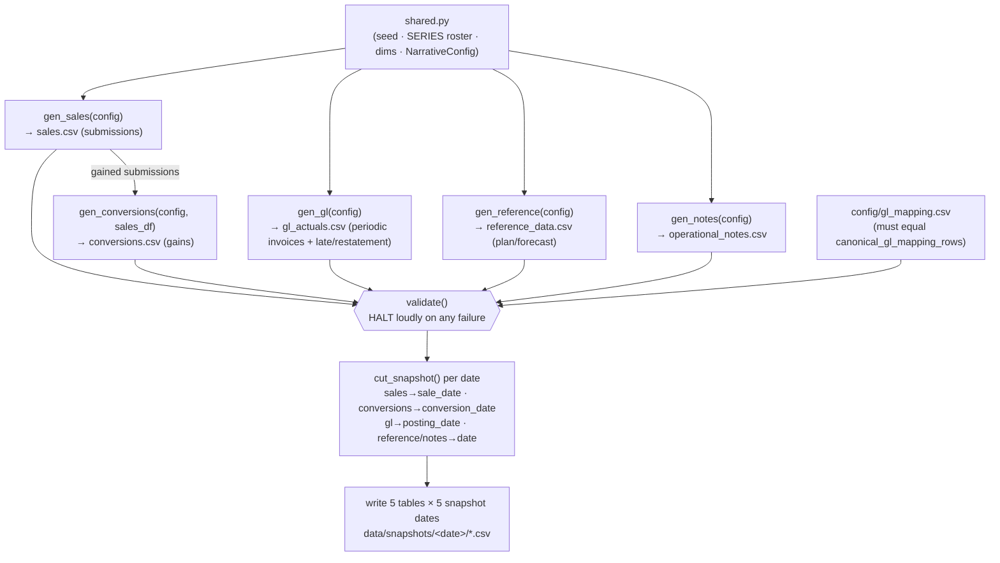

# Athena — Data Dictionary

> **Purpose:** Every field, defined. This is the contract for both the synthetic-data generator (`scripts/generate_snapshots.py`) and the ingestion validator. Build this out *before* writing analytics modules — define the data, then compute on it.
>
> **Status:** Seeded from the schema in `athena_context.md` §13. Tighten ranges, add constraints, and add any new fields as the generator takes shape. Mark fields the validator must enforce.
>
> **Conventions:** dates ISO `YYYY-MM-DD` · money as float in base currency unless noted · nullable means the field may be empty and downstream logic has a defined fallback (see context doc §9–10).

---

## The dimension hierarchy
The operational facts (`sales`, `conversions`) and `reference_data` carry the same
denormalized dimension hierarchy — generic column names, domain-specific values, the way an
enterprise data mart delivers pre-dimensioned facts:

| Field | Type | Nullable | Definition | Validation / notes |
|---|---|---|---|---|
| entity | string | no | Market / ISO (e.g. ERCOT, PJM) — top of the geography | Must exist in the series roster |
| region | string | no | Sub-market region (North/South/West/East) | Must exist in the series roster |
| service_territory | string | no | Delivery utility / TDU under the market (Oncor, CenterPoint, AEP_Texas, PECO, BGE) | Must exist in the series roster |
| segment | string | no | Acquisition channel: `Web_Direct` / `Door_to_Door` / `Telemarketing` / `Inbound_Call_Center` / `Direct_Mail` / `Online_Partner` | Must exist in the series roster |
| product_type | string | no | Term / Month_to_Month | Must match cogs_config |
| contract_term_months | int | yes | Contract length for Term (12/24/36); **null for Month_to_Month** | If present ∈ {12,24,36} |
| customer_size_tier | string | no | residential / small_C&I / large_C&I | — |
| customer_class | string | yes | single_family / multi_family — **residential only; null for C&I** | Non-null implies residential |

A fact/reference row's full dimension tuple (these eight fields, in this order) is its join
identity — it must match exactly one series in the roster.

**Roster = units × mix.** The generator's backbone is ~12 channel×geography *units* (one set of
economics + total volume each). Each unit fans out into a small **mix** of 2–3 leaf series
across `product_type` / `contract_term_months` / `customer_class` — so a real channel×region
carries a spread of products/customers, not a single flavor. The unit's volume is split across
the mix by weight; **economics are uniform across a unit's leaves** (the product/customer dims
vary the *mix*, not the per-unit numbers — they can be made to drive economics later).
`customer_size_tier` stays unit-level (residential and C&I are not blended under one unit). GL
spend and `gl_mapping` stay at the **unit** grain (the leaf mix doesn't affect the ledger).

---

## sales.csv
Record-level submissions (enrollments). One row per sale. This is the **fallout denominator**
and the source of the `customer_key` that links a gained submission to `conversions.csv`.

| Field | Type | Nullable | Definition | Validation / notes |
|---|---|---|---|---|
| customer_key | int | no | Surrogate key, one per submission; the join key to `conversions` | Unique; per-series integer blocks |
| sale_date | date | no | Day the sale was submitted (snapshots cut `sales` on this) | Must parse; not in the future |
| *(dimensions)* | — | — | The eight hierarchy fields above | See dimension hierarchy |

*A submission carries **no outcome** — at sale time the result is unknown.* Whether a sale
becomes a gain is decided by `gen_conversions`; **fallout is derived by anti-join**: a
submission whose `customer_key` has no matching row in `conversions.csv` fell out. So fallout
rate (per segment/cohort) = submissions with no matching conversion ÷ submissions, computed
downstream. Because conversions lag (a gain lands days after the sale), fallout is only
*resolved* for submissions older than the max conversion lag — recent sales are still pending,
which is the realistic, no-lookahead behavior. Only the fallout series degrades its conversion
rate across the active period, lifting its unmatched share.

*Runtime display:* the analytics layer (`data_merger`) surfaces fallout **as computed at each
snapshot** — the raw unmatched share in that cut, pending sales included — so it climbs across
the pre-close window and partially settles post-close as lagged gains land. It is shown as a
lagging signal (with confidence context downstream), **never suppressed** for being unresolved
(§9). See `decisions_log.md` → Build Sequence 3.

*`customer_key` convention:* each series numbers its submissions within its own block
(`(series_index+1) × 1,000,000 + local_index`), so keys are plain integers yet stable —
retuning one series' volume does not renumber the others.

---

## conversions.csv
Record-level gains. One row per submission that converts. `gen_conversions` decides which
submissions convert (drawing on the series' conversion rate) and emits a gain for each, so the
two feeds reconcile on `customer_key`. Source of conversion counts (CPA = GL acquisition spend
÷ conversions) and of price for margin.

| Field | Type | Nullable | Definition | Validation / notes |
|---|---|---|---|---|
| customer_key | int | no | Same key as the matching submission in `sales.csv` | Unique; ⊆ `sales.customer_key` |
| sale_date | date | no | Carried through from the submission | — |
| conversion_date | date | no | Day the gain landed = `sale_date` + lag (snapshots cut `conversions` on this) | ≥ `sale_date` |
| *(dimensions)* | — | — | The eight hierarchy fields above | Must match the matching sale |
| price_per_unit | float | yes | Contracted price/rate per unit; drives margin (`margin = price_per_unit − cogs_per_unit`) | ≥ 0 if present; null → plan margin fallback |

*Generator notes:* the CPA spike is engineered by raising GL spend faster than conversions
grow across snapshots (see gl_actuals). A gain with an old `sale_date` but recent
`conversion_date` appears only from the snapshot on/after its conversion date — modeling
reporting lag. (Renamed from the former single `actuals.csv`; `revenue_per_unit` →
`price_per_unit`. See `decisions_log.md`.)

---

## gl_actuals.csv
Raw general-ledger spend — a **dimension-free** ledger. It carries no
entity/region/segment; the business meaning is reconstructed via `gl_mapping.csv`
keyed on `(cost_center, gl_account, vendor)`. Source of CPA actuals and
late-invoice/restatement detection. `cost_center` = WHO spent (the acquisition
channel), `gl_account` = WHAT (media / hours / commissions / bonuses / overhead).

| Field | Type | Nullable | Definition | Validation / notes |
|---|---|---|---|---|
| posting_date | date | no | Date the entry hit the ledger (snapshots cut on this) | Must parse; not in the future |
| document_date | date | no | Invoice/document date — the period the cost covers | gap vs. posting_date drives late-invoice + accrued/restated detection |
| cost_center | string (numeric code) | no | The acquisition channel / business unit (e.g. `5010`) | (cost_center, gl_account, vendor) must exist in gl_mapping |
| cost_center_description | string | no | Human label (e.g. "Web Direct") | denormalized for ease of use |
| gl_account | string (numeric code) | no | Expense type (e.g. `6010`) | must exist in gl_mapping |
| gl_account_description | string | no | Human label (e.g. "Media") | denormalized |
| amount | float | no | Spend amount | ≥ 0 (no negative spend unless modeling reversals) |
| vendor | string | no | Supplier; part of the mapping key (resolves geography / disambiguates channel) | — |
| description | string | yes | GL line description; feeds retrieval/context layer | Free text |

*Generator notes:* spend is emitted as **periodic invoices** (per-channel cadence — see
gl_mapping notes). The hero CPA spike is engineered here (its weekly media invoices ramp
across the active period); sales/conversions stay flat. The engineered late April invoice
(posts May, document April → `accrued`) and the post-close May true-up (posts June, document
May → `restated`) exercise the completeness states.

---

## reference_data.csv
Plan and forecast targets. Same schema, distinguished by `reference_type`.

| Field | Type | Nullable | Definition | Validation / notes |
|---|---|---|---|---|
| date | date | no | Reporting period (plan = first-of-month; forecast = issue date) | Must parse |
| *(dimensions)* | — | — | The eight hierarchy fields (see *The dimension hierarchy* above) | Full tuple must match a series |
| reference_type | string | no | `plan` or `forecast` | Must be one of the two |
| volume_in_ref | int | no | Reference inbound volume (**leaf grain** — vs. record-level sales aggregated per sub-segment) | ≥ 0 |
| volume_converted_ref | int | no | Reference conversions (**leaf grain** — vs. conversions aggregated per sub-segment) | ≥ 0 |
| cost_ref | float | no | Reference spend; the **unit plan cost allocated to the leaf** by planned conversions | ≥ 0 |
| cpa_ref | float | no | Reference CPA (a **unit / channel×geography** target, repeated on the unit's leaves) | ≥ 0 |
| cogs_ref | float | no | Reference COGS per unit — the **plan-COGS fallback** (§10); matches `cogs_config` (one source) | ≥ 0 |
| ltv_ref | float | no | Reference LTV — fallback when calculated LTV unavailable | ≥ 0 |
| margin_ref | float | no | Reference margin per unit — fallback | — |

*Grain & GL tie-back:* **volume** targets are leaf-grain (compare to record-level actuals);
**cost/CPA** targets are a unit (channel×geography) plan allocated across leaves, so
`Σ cost_ref` over `(entity, region, segment)` is the unit's plan cost — which reconciles to
actual GL acquisition spend (`gl_mapping` resolves GL to the same `(entity, region, segment)`),
and `cpa_ref` is the plan CPA to compare against `GL spend ÷ conversions` at that grain. The
orchestrator validates that **every acquisition unit `gl_mapping` resolves to has an
active-period plan row.**

*Plan realism:* `plan` volume/CPA default to the noise-free actual baseline (so the engineered
spike/fallout is the only signal). A per-unit `plan_bias` ({"volume":…, "cpa":…}) can make the
plan miss independently; empty by default.

*Note:* `plan` rows are locked once a period begins; `forecast` rows update. The generator should emit at least `plan`; add `forecast` rows to demo the plan-vs-forecast-gap alert.

*Generator convention (Phase 1):* `plan` rows are dated to the first of the reporting month. `forecast` rows are dated to their **issue date** (e.g. 2024-05-10), not the period start — so a forecast "arrives" mid-period and only surfaces from the snapshot on/after that date (snapshots are cut cumulatively; see *Snapshot conventions* below). `reference_type` still disambiguates the row; consumers comparing actuals vs. a reference should select by `reference_type` and the reporting period it targets, not assume `date` is the period start.

---

## operational_notes.csv
Qualitative commentary. Feeds the context/retrieval layer and is what lets the narrative reference a likely cause.

| Field | Type | Nullable | Definition | Validation / notes |
|---|---|---|---|---|
| date | date | no | Note date | Must parse |
| entity | string | yes | Relevant market, or `ALL` | — |
| region | string | yes | Relevant region, or `ALL` | — |
| segment | string | yes | Relevant segment, or `ALL` | — |
| note_text | string | no | Free-text operational commentary | The retrievable content |
| author | string | yes | Note source | — |

*Generator notes:* seed a note dated ~May 8 about a campaign launch in the channel whose CPA spikes — this is what the May-22 narrative connects to. This is also the test bed for the RAG-vs-filtering question (`open_questions.md`).

*Generator convention (Phase 1):* `entity`/`region`/`segment` use the literal string `"ALL"` (not null) for organization-wide notes, so a note always carries an explicit scope. Validators/consumers should treat `"ALL"` as a per-level wildcard.

---

## Config / reference tables (`/config`)

### gl_mapping.csv
The bridge from the dimension-free ledger to the business. **One row per
`(cost_center, gl_account, vendor)` combo** that appears in `gl_actuals.csv`,
resolving it to a gain channel + geography. Must equal
`shared.canonical_gl_mapping_rows()` (the orchestrator enforces this).

| Field | Type | Notes |
|---|---|---|
| cost_center | string | numeric channel code (e.g. `5010`); 1:1 with `segment` |
| cost_center_description | string | label (e.g. "Web Direct") |
| gl_account | string | numeric expense-type code (e.g. `6010`) |
| gl_account_description | string | label (e.g. "Media") |
| vendor | string | supplier; resolves geography and disambiguates channel — the same `(cost_center, gl_account)` can map to different `(entity, region)` via different vendors |
| segment | string | resolved gain channel (blank for overhead) |
| entity | string | resolved market (blank for overhead) |
| region | string | resolved region (blank for overhead) |
| spend_category | string | `acquisition_marketing` (ties to a gain) or `overhead` (token, mapped out of CPA) |

*Invoice cadence (drives GL-completeness states):* per-channel — **weekly** for
Door_to_Door (the hero, so its commission spike shows each snapshot), Web_Direct,
Telemarketing, Inbound_Call_Center; **monthly** (posts at month-end, in arrears)
for Direct_Mail and Online_Partner, so those channels have no in-month spend early
and their CPA falls back to an estimate until the post-close snapshot. Channels
with a bonus account (Door_to_Door, Telemarketing) use GL account `6040`: for
non-hero channels it's a carved slice of acquisition spend; for the **hero** it's
an *additive* Q2 incentive surge paid at month-end (extra CPA damage that lands
only in the post-close snapshot, alongside the restatement).

Both config tables below are **derived from the roster and validated against it**
(`shared.canonical_cogs_config_rows()` / `canonical_retention_config_rows()`; the orchestrator
halts on any drift) — like `gl_mapping`, so they can never go stale. They're keyed by the **full
dimension hierarchy, one row per sub-segment** (33 rows). Values are uniform within a unit today
(the unit's single rate), but a unit can override `cogs`/`retention` by `product_type` or by an
exact sub-segment (precedence: sub-segment > product_type > unit default) — the per-segment
tuning knob.

### cogs_config.csv
The standing COGS input. **COGS lives in two places by design (§10):** this table is the
authoritative configured rate (the **current/actual** COGS); `reference_data.cogs_ref` is the
**plan COGS** at the bottom of the fallback chain (current input → trailing-avg → plan). They
derive from the same per-leaf value by default, so they normally agree — **except where an
engineered anomaly makes the actual diverge from the flat plan** (see below).

This table is also **time-varying**: a unit may carry **more than one effective-dated row** for the
same leaf, so the standing rate can step up/down over time. `metrics_calculator` resolves the rate
whose `effective_date` is the latest on/before the period-end.

| Field | Type | Notes |
|---|---|---|
| *(dimensions)* | — | The eight hierarchy fields (**one row per sub-segment _per effective_date_**) |
| cogs_per_unit | float | Cost per unit (resolved per sub-segment; uniform within a unit at a given effective_date unless overridden) |
| cogs_comparison_mode | string | linear_trend / prior_year_same_period / plan_vs_actual / hybrid |
| effective_date | date | When this rate became active (the unit's history start, or a later step for a rate change) |

*Engineered COGS anomaly (demo):* **Online_Partner, ERCOT North** carries a second row at
`effective_date 2024-05-15` with `cogs_per_unit` **+22%** above its base, while its plan `cogs_ref`
stays flat — a standalone COGS-spike / margin-compression beat on an otherwise-calm channel (set via
`Series.cogs_anomaly` in `shared.py`; see `decisions_log.md`).

### retention_config.csv
Drives calculated LTV (config-only — the plan carries computed `ltv_ref`, so no duplication).

| Field | Type | Notes |
|---|---|---|
| *(dimensions)* | — | The eight hierarchy fields (one row per sub-segment) |
| expected_retention_periods | float | Average retention in periods (resolved per sub-segment) |
| effective_date | date | When this input became active |

### system_config.yaml
| Key | Type | Notes |
|---|---|---|
| period_close_day | int | Day after which a period is considered closed |
| pro_rate_default | string | calendar_days or business_days |
| batch_frequency | string | daily / weekly / custom cron |
| cpa_ltv_warning_threshold | float | Default 0.80 — MEDIUM CPA-vs-LTV **compression** alert, evaluated on **T3M** CPA / LTV |
| thresholds | map | `risk_classifier` alert bands (BS3). Sub-keys: `cpa_spike`/`cogs_spike`/`margin_compression`/`volume_miss` `{medium, high}` (fractional variance); `fallout_rate {medium, high}` (relative to the channel's trailing baseline); `cpa_ltv_inversion` (T12M CPA/LTV); `restatement_cpa {medium}`; `plan_vs_forecast {medium}`; `cpa_trend_months`/`cogs_trend_months` (int) |
| min_confidence_display | string | always_show — low confidence shown, never suppressed |
| data_mode | string | snapshot or live |
| snapshot_date | date | Active snapshot — ignored in live mode |
| snapshot_path | string | Path to snapshots — ignored in live mode |
| live_data_path | string | Path to live data — ignored in snapshot mode |

---

## Snapshot conventions (generator)
Each snapshot folder (`data/snapshots/<date>/`) is a **cumulative** cut of the
full timeline — all rows dated on/before the snapshot date. Each feed is cut on
the date the data *lands*:
- `sales` → `sale_date`
- `conversions` → `conversion_date` (so a gain with an early `sale_date` but a
  later `conversion_date` appears only from the snapshot on/after it lands)
- `gl_actuals` → `posting_date` (a late entry posted in May appears only from the
  snapshot on/after its posting date, regardless of its earlier `document_date`)
- `reference_data` / `operational_notes` → `date`

Prior-period history is present in every snapshot, so trailing metrics work
throughout. The same five per-table files exist in every snapshot and can be
emitted as `.csv` and/or `.xlsx`.

## Generation pipeline (DAG)
`scripts/generate_snapshots.py` runs this directed acyclic graph. The only
inter-generator dependency is **`gen_conversions` ← `gen_sales`**: `gen_conversions`
reads the submissions, decides which convert, and emits gains sharing
`customer_key` (so fallout is the unmatched complement). The other four
generators read only `shared` + `config`. `validate()` is a hard gate — on any
failure it raises `PipelineHalt` and nothing is written.



ASCII fallback (same graph):

```
shared.py ─┬─> gen_sales ──────────────┐
           │        └─(gained)─> gen_conversions ─┐
           ├─> gen_gl ───────────────────────────┤
           ├─> gen_reference ────────────────────┤──> validate() ─[gate]─> cut_snapshot ─> write
           └─> gen_notes ────────────────────────┤        ▲
config/gl_mapping.csv ───────────────────────────┘────────┘
```

What each edge guarantees:
- **`shared → *`** — every generator draws dimensions/dates/RNG from the one
  roster, so no generator can invent a join key.
- **`gen_sales → gen_conversions`** — the only inter-generator edge; sales are
  pure submissions (no outcome), and `gen_conversions` decides which convert and
  emits gains sharing `customer_key`. Fallout = submissions with no matching gain.
  Fixed order in `main()`: sales, then conversions.
- **`gen_notes` is independent** — authored rows scoped to a real
  `(entity, region, segment)` or the `"ALL"` wildcard; it joins downstream by
  scope, not by `customer_key`.
- **`* → validate → cut → write`** — the gate consumes all five frames +
  `gl_mapping.csv`; only validated frames are cut (each on the date it lands) and
  written. Bad data never reaches a snapshot.

## Generation checklist (Phase 1) — ✅ COMPLETE (see `build_log.md`)
- [x] Five snapshot dates — four pre-close (May 1 / 8 / 15 / 22) + one post-close final (June 8), each cumulative
- [x] Demo arc visible: calm → drift → building → confirmed HIGH (context doc §8)
- [x] At least one operational note that explains the spiking channel
- [x] At least one late/accrued GL entry to exercise completeness states
- [x] Plan rows for everything; forecast rows for the plan-vs-forecast demo
- [x] A new entity/segment with no history to exercise the first-run fallback
- [x] Manually inspect: does it feel operationally real?
